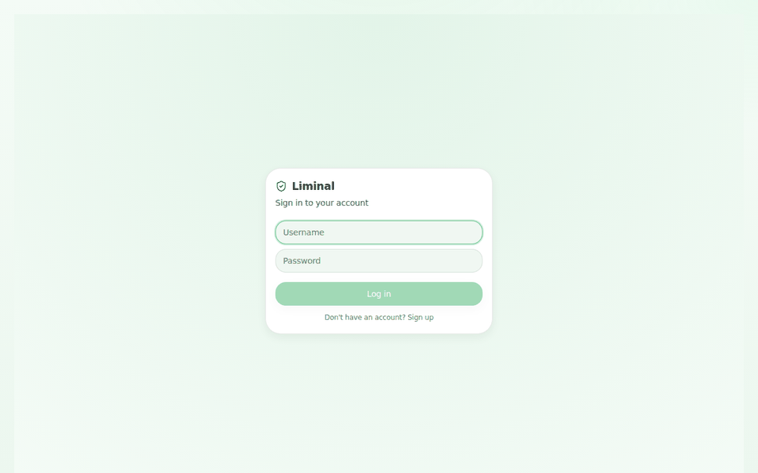

<div align="center">

# 🛡️ Liminal

**Threat intel, live infra watch.**

An AI-assisted security console that triages indicators of compromise and keeps an eye on the cloud services your app actually runs on.



</div>

---

## What it does

Liminal is a full-stack app with two halves that share one login:

**Security / Threat Intel**
- **Manual Analysis** — drop in a file hash, URL, IP, or domain and get a verdict, backed by VirusTotal, AbuseIPDB, OTX, and the abuse.ch feeds (URLhaus, MalwareBazaar, ThreatFox).
- **Liminal (AI)** — a chat interface that detects indicators in plain-English messages, aggregates results across those sources, and summarizes them (via Groq) into a headline, findings, and a recommendation.
- **History** — every past analysis, saved per account.

**Infrastructure Watch**
- **Connected Apps** — link your Render, Netlify, Vercel, Supabase, Neon, MongoDB, UptimeRobot, and GitHub accounts (credentials encrypted at rest with Fernet).
- **Watchlist** — incidents raised against those connected resources, with AI-generated summaries and remediation playbooks.
- **Remote Actions** — a provider-agnostic way to act on an incident directly (e.g. restart a Render service, redeploy a Netlify site), fully scoped and audited per account.

Every route is account-scoped: one user can never see another's integrations, history, or incidents.

## Stack

| | |
|---|---|
| **Frontend** | React 18 + Vite, Tailwind CSS, react-markdown |
| **Backend** | FastAPI, SQLAlchemy, JWT auth (`python-jose`), Fernet encryption |
| **AI** | Groq (chat summaries, incident recommendations) |
| **Threat intel** | VirusTotal, AbuseIPDB, OTX, abuse.ch (URLhaus / MalwareBazaar / ThreatFox) |
| **Infra integrations** | Render, Netlify, Vercel, Supabase, Neon, MongoDB, UptimeRobot, GitHub |

## Getting started

### 1. Backend

```bash
cd backend
python -m venv venv && source venv/bin/activate
pip install -r requirements.txt
cp .env.example .env   # then fill in the keys below
./run.sh                # uvicorn app.main:app --reload --port 8000
```

`.env` values:

| Variable | Required | Notes |
|---|---|---|
| `JWT_SECRET` | ✅ | `python -c "import secrets; print(secrets.token_hex(32))"` |
| `FERNET_KEY` | ✅ | `python -c "from cryptography.fernet import Fernet; print(Fernet.generate_key().decode())"` |
| `GROQ_API_KEY` | ✅ | Free at [console.groq.com](https://console.groq.com) — powers summaries & chat |
| `ABUSECH_API_KEY` | ✅ | Free at [auth.abuse.ch](https://auth.abuse.ch) — needed for URLhaus/MalwareBazaar/ThreatFox |
| `VT_API_KEY`, `ABUSEIPDB_API_KEY`, `OTX_API_KEY` | optional | App works without them; just skips that source |
| `CORS_ORIGINS` | ✅ | Comma-separated frontend origin(s) |

### 2. Frontend

```bash
cd frontend
cp .env.example .env   # VITE_API_URL=http://localhost:8000/api
npm install
npm run dev             # http://localhost:5173
```

### 3. Production build

```bash
cd frontend && npm run build
```

The backend serves the built `frontend/dist` directly, so in production you only need to run the FastAPI app (`./backend/run.sh` or your ASGI server of choice) pointed at the same directory.

## Project layout

```
backend/
  app/
    routers/        # auth, chat, analyze, history, integrations, watchlist, remote_actions, + one per provider
    core/            # auth, encryption, rate limiting, ownership checks, LLM + aggregation logic
    services/        # threat-intel clients + per-provider integration/remote-action implementations
    db/               # SQLAlchemy models & CRUD
frontend/
  src/
    pages/           # one screen per sidebar section
    components/      # chat window, analysis cards, per-provider dashboards, etc.
```

## Security notes

- Passwords are hashed; JWTs sign sessions; integration credentials are encrypted at rest (Fernet) and only decrypted server-side when an action actually runs.
- All history/integration/incident/remote-action queries are scoped to `get_current_user`, not to a client-supplied ID.
- Login and registration are rate-limited per IP.

---

